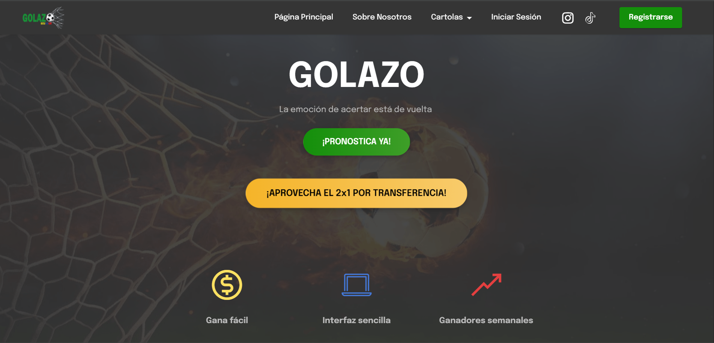
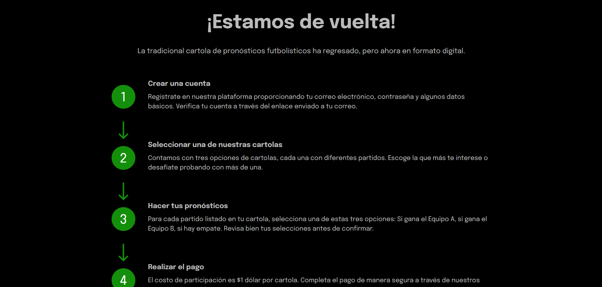
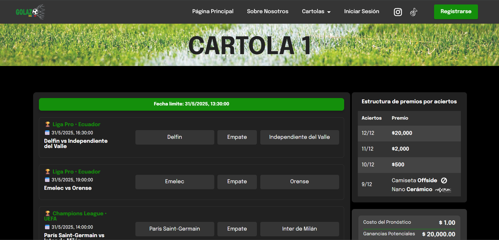
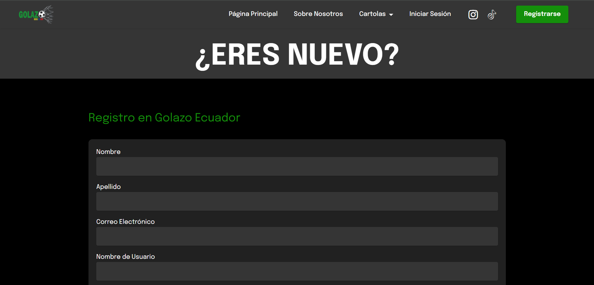
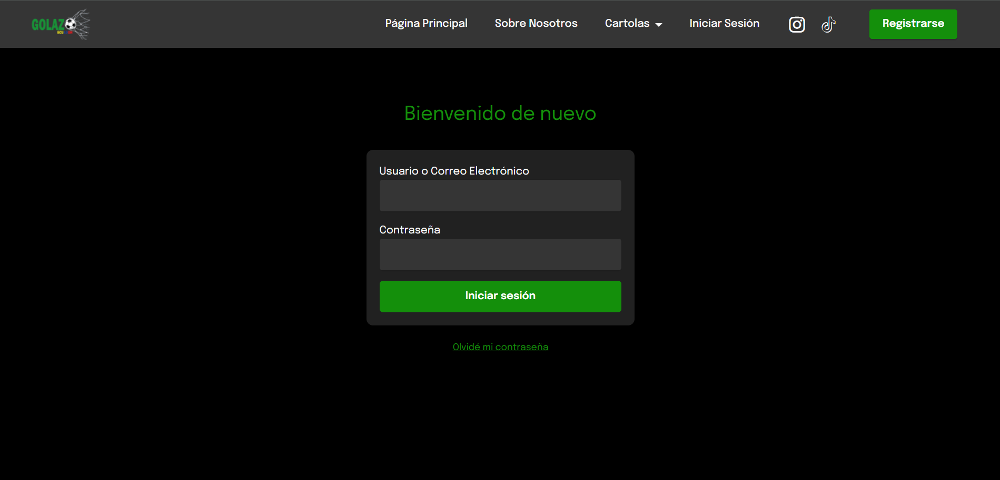
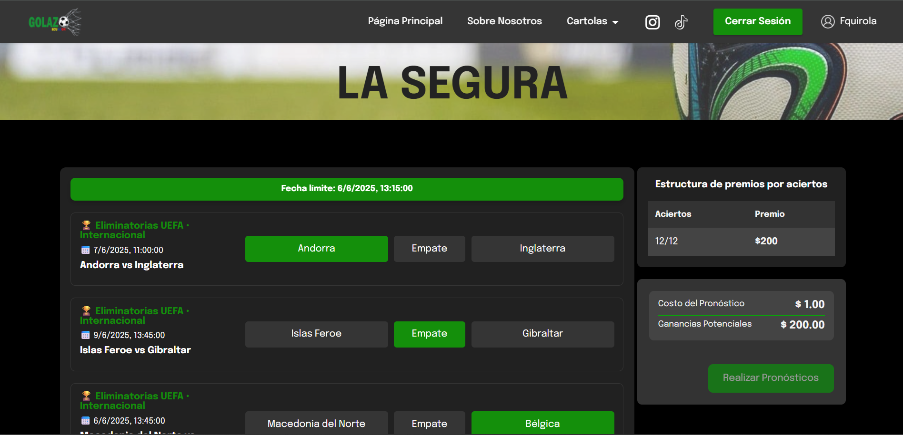
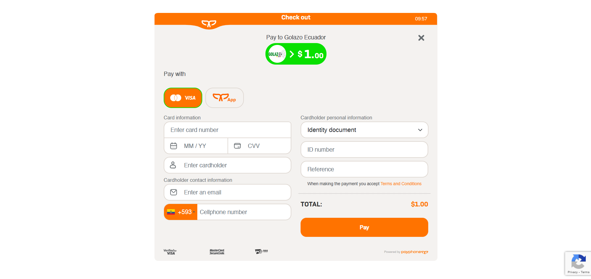
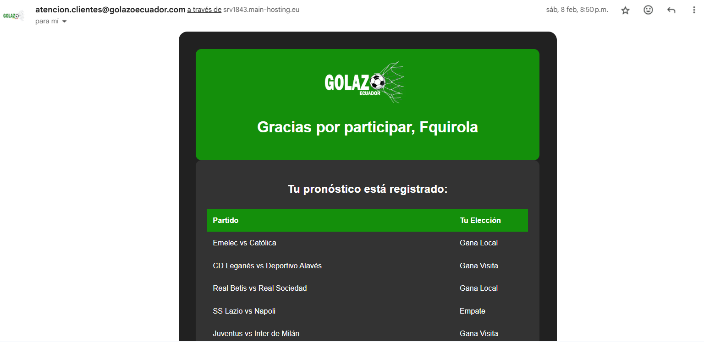

# ⚽ Golazo Ecuador – Sports Predictions (Showcase)

**Golazo Ecuador** is a web platform for **combo sports predictions** called **cartolas**: each cartola combines **12 matches**. Prizes scale with the number of correct picks. The platform includes **account registration/login**, **automatic emails**, and a **payment gateway** for seamless checkout.

> 🌐 Live site: https://golazoecuador.com  
> 🔒 This repository is a **showcase only** (no source code) – it includes screenshots, features, and technical details.

---

## ✨ Key Features
- **Cartolas (12-match combos):** Make picks across 12 matches on a single slip.
- **Tiered prizes:** Payouts increase with higher hit counts.
- **Account system:** Registration, login, secure sessions.
- **Payment gateway:** Safe checkout and confirmation.
- **Automated emails:** Registration and purchase confirmations.
- **Responsive UI:** Smooth experience on desktop and mobile.

---

## 📸 Screenshots

  
  
  

  
  
  

  
  
  

  
  
  

---

## 🛠️ Tech Overview
- **Frontend:** HTML, CSS, JavaScript (vanilla)
- **Backend:** PHP
- **Database:** MySQL
- **Payments:** Integrated gateway (secure checkout)
- **Emails:** Automated transactional messages

> Note: Specific implementation details and source code are private.

---

## 🚀 Deployment
- Hosted at **golazoecuador.com** with SSL.
- Optimized for both desktop and mobile users.

---

## 🗺️ Roadmap
- [ ] Leaderboard & public winners page  
- [ ] More payment methods  
- [ ] Notifications & match reminders  

---

## 👤 Author
**Felipe Quirola** — Computer Science Engineering Student (7th semester, EPN)  
Freelancer · Web pages & mobile apps  
- 📧 [Email](mailto:fquirola2@gmail.com)

---

## 📝 License
This showcase is published under the **MIT License**. See [LICENSE](LICENSE).
